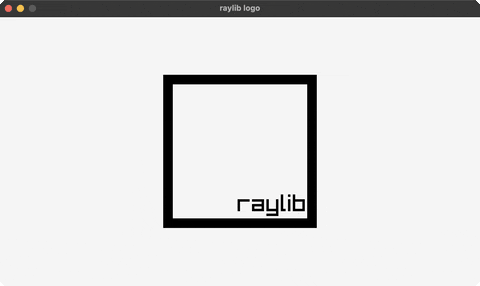

<!-- Generated by `bb resync` from raylib-jlt. Edits here are overwritten. -->
# logo

the raylib logo from rectangles + text

Category: shapes



## Run it

```sh
cd logo && bb run   # from this demo (or jolt run, jolt -M:run)
bb logo             # from the repo root (or jolt -M:logo)
```

## About

raylib logo (`joltc -M:logo`).

A static render of raylib's signature logo, a thick black square border with
'raylib' tucked into the bottom-right corner, built from two rectangles and a
text label positioned with MeasureText.
