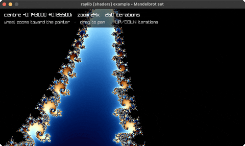

# mandelbrot-set

the Mandelbrot set, zoomable, in a shader

Category: shaders



## Run it

```sh
cd mandelbrot-set && bb run   # from this demo (or jolt run, jolt -M:run)
bb mandelbrot-set             # from the repo root (or jolt -M:mandelbrot-set)
```

## About

raylib [shaders] example - Mandelbrot set (`jolt -M:mandelbrot-set`).

The Mandelbrot set, evaluated per pixel in a fragment shader. The wheel zooms
toward the pointer rather than the window centre, which is what makes deep
diving feel like navigation instead of arithmetic; dragging with the left button
pans. UP/DOWN change the iteration cap, and deep zooms need it - detail vanishes
into flat colour long before the shape runs out.

The companion to julia-set: the same escape-time loop, but iterating from z = 0
with c taken from the pixel, rather than from the pixel with c fixed. That one
swap is the whole difference between the two sets, and it is why julia-set's
shape is connected exactly when its c lies inside this one.

Single-precision floats run out of resolution around zoom 1e5, where the image
goes blocky. That is the shader's limit, not the maths, and it is left visible
rather than clamped away.
