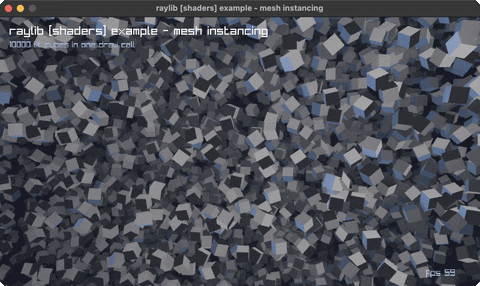

# mesh-instancing

10000 lit cubes in one draw call

Category: shaders



## Run it

```sh
cd mesh-instancing && bb run   # from this demo (or jolt run, jolt -M:run)
bb mesh-instancing             # from the repo root (or jolt -M:mesh-instancing)
```

## About

raylib [shaders] example - mesh instancing (`jolt -M:mesh-instancing`).

Port of raylib's examples/shaders/shaders_mesh_instancing.c. Ten thousand
lit cubes in a single draw call.

Instancing moves the per-copy transform out of the draw loop and into a
vertex attribute. One mesh and one material go to the GPU, alongside an
array of ten thousand matrices, and the vertex stage reads its own matrix
per instance from `in mat4 instanceTransform`. The alternative, a DrawMesh
per cube, is ten thousand draw calls a frame.

Nothing has to be wired up for that attribute. raylib 6.0 resolves it by
name when the shader loads, filling SHADER_LOC_VERTEX_INSTANCETRANSFORM from
the attribute called `instanceTransform`. This is worth saying because
raylib's example on master assigns a locs slot by hand, and assigns a
different one: that code targets a later raylib than the 6.0 here, and
copying it would set a slot 6.0 never reads while leaving the one it does
read already correct.

The lighting is the shader from net.b12n.raylib-jlt.basic-lighting, unchanged
except that the vertex stage multiplies by the instance matrix. Distance
fades the far cubes the same way net.b12n.raylib-jlt.fog-rendering does.

The matrices are built once. Rebuilding ten thousand of them per frame would
cost more than the draw call it saves, so the field turns by orbiting the
camera instead.
