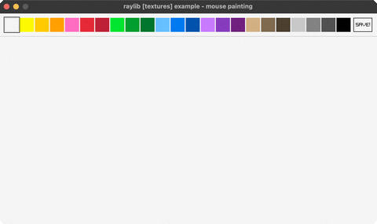

<!-- Generated by `bb resync` from raylib-jlt. Edits here are overwritten. -->
# mouse-painting

a paint program on a render-texture canvas

Category: textures



## Run it

```sh
cd mouse-painting && bb run   # from this demo (or jolt run, jolt -M:run)
bb mouse-painting             # from the repo root (or jolt -M:mouse-painting)
```

## About

raylib [textures] example - mouse painting.

A paint program on a render texture: LEFT paints with the selected color,
RIGHT erases (temporarily switching to the background color), the mouse
wheel sizes the brush, the top strip picks one of 23 colors, C clears, S
or the SAVE button takes a whole-window screenshot. No new bindings.
Ported from raylib's examples/textures/textures_mouse_painting.c.
