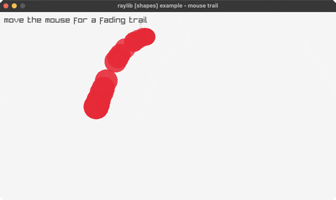

<!-- Generated by `bb resync` from raylib-jlt. Edits here are overwritten. -->
# mouse-trail

a fading trail follows the cursor

Category: shapes



## Run it

```sh
cd mouse-trail && bb run   # from this demo (or jolt run, jolt -M:run)
bb mouse-trail             # from the repo root (or jolt -M:mouse-trail)
```

## About

raylib [shapes] example - mouse trail (`joltc -M:mouse-trail`).

A fading trail of circles follows the cursor: each frame the newest mouse
position is pushed onto a bounded history, and the whole history is drawn with
fading alpha + shrinking radius (older = fainter and smaller).
