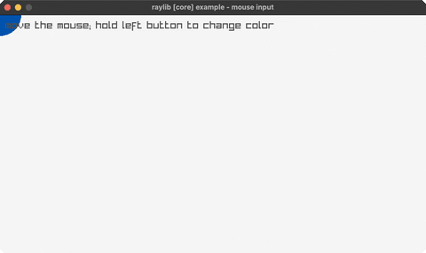

<!-- Generated by `bb resync` from raylib-jlt. Edits here are overwritten. -->
# mouse

a ball follows the mouse; click to recolor

Category: core



## Run it

```sh
cd mouse && bb run   # from this demo (or jolt run, jolt -M:run)
bb mouse             # from the repo root (or jolt -M:mouse)
```

## About

raylib [core] example - mouse input (`joltc -M:mouse`).

Ported from examples/core/core_input_mouse.c: a circle follows the cursor and
turns LIME while the left button is held. Uses the scalar GetMouseX / GetMouseY
(not GetMousePosition, which returns a Vector2 by value).
