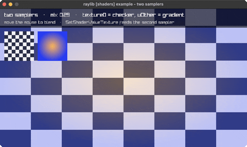

<!-- Generated by `bb resync` from raylib-jlt. Edits here are overwritten. -->
# multi-sampler

two textures blended by a second sampler

Category: shaders



## Run it

```sh
cd multi-sampler && jolt -M:run   # from this demo
jolt -M:multi-sampler             # from the repo root
```

## About

raylib [shaders] example - two samplers (`jolt -M:multi-sampler`).

raylib binds the texture you draw to sampler slot 0 and names it `texture0`.
Everything past that is the caller's job: a second sampler is a uniform you
fill with SetShaderValueTexture. This example blends a checkerboard against a
radial gradient, with the mix driven by the mouse.

The call is the reason this example exists. SetShaderValueTexture takes a
Shader AND a Texture2D, both by value, and on arm64 they travel by different
routes - Shader is 16 bytes and goes in general-purpose registers, Texture2D is
20 and is therefore passed indirectly, through a pointer the caller supplies.
One signature, both ABI paths, which is the case worth having an example of.

LEFT/RIGHT nudge the mix when the pointer is off-window.
