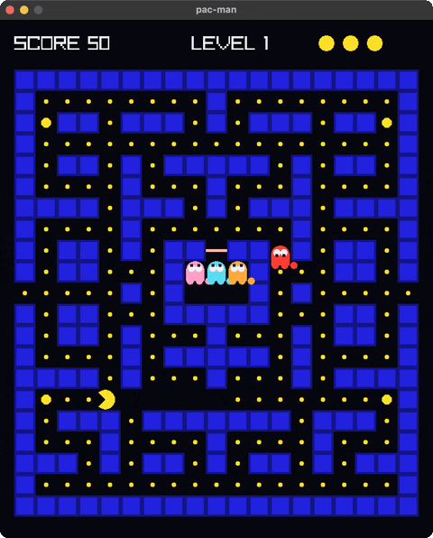

<!-- Generated by `bb resync` from raylib-jlt. Edits here are overwritten. -->
# pacman

pac-man, with the classic ghost personalities

Category: games



## Run it

```sh
cd pacman && jolt -M:run   # from this demo
jolt -M:pacman             # from the repo root
```

## About

Pac-Man (`jolt -M:pacman`).

Arrows or WASD steer, ENTER restarts after GAME OVER.

The ghosts keep the personalities the 1980 original gave them, which is where
the game's character comes from. Blinky heads for Pac-Man's tile. Pinky aims
four tiles AHEAD of him, to cut him off. Inky reflects Blinky's tile through a
point two tiles ahead of Pac-Man, which is why he seems to change his mind.
Clyde chases until he is within eight tiles, then breaks for his corner. They
alternate scatter and chase on a timer, and turn blue while a power pellet is
in effect.

The whole world is one immutable map threaded through the loop; `step` reads
input and returns the next state, and nothing under it draws. Movement is the
part worth reading: a turn is BUFFERED on the keypress and applied at the next
tile centre where it is legal, because deciding a direction anywhere but a
centre is what lets an entity drift into a wall.

Pac-Man himself is `rl/sector!` — a pie slice from the far side of his mouth
round to the near side, so the mouth is the missing wedge. The rest is
rectangles, circles and text.
