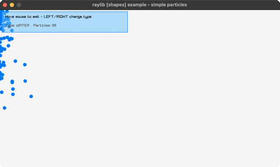

# particles

water/smoke/fire particles follow the mouse

Category: generative



## Run it

```sh
cd particles && bb run   # from this demo (or jolt run, jolt -M:run)
bb particles             # from the repo root (or jolt -M:particles)
```

## About

raylib [shapes] example - simple particles.

Move the mouse to emit particles. LEFT/RIGHT cycle the type (water falls,
smoke rises and fades, fire shrinks yellow -> red). No new bindings:
Fade(color, a) and ColorLerp are both just packed-int arithmetic on the
already-bound rl/rgba, since a Color here is a plain :uint.
Ported from raylib's examples/shapes/shapes_simple_particles.c.
