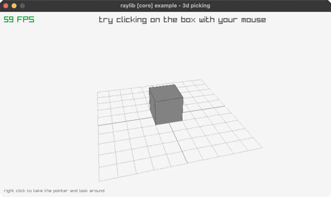

<!-- Generated by `bb resync` from raylib-jlt. Edits here are overwritten. -->
# picking-3d

click a box: a real GetScreenToWorldRay pick

Category: 3d



## Run it

```sh
cd picking-3d && jolt -M:run   # from this demo
jolt -M:picking-3d             # from the repo root
```

## About

raylib [core] example - 3d picking (`jolt -M:picking-3d`).

Port of raylib's examples/core/core_3d_picking.c. Click the box and it lights
up, click again to let it go. The ray the click cast stays drawn in the world,
so you can see where it went when you miss. Right-click captures the pointer
and hands the camera over to mouse-look; right-click again gives it back.

New FFI, and the reason this one is worth reading: `GetScreenToWorldRay` is
the exact inverse of the `GetWorldToScreen` the suite already had, and it is
bound the same way. A by-value Vector2 in, a by-value Camera3D in, a by-value
Ray out. `GetRayCollisionBox` then takes that Ray with a by-value BoundingBox
and returns a by-value RayCollision, whose first field is a one-byte C _Bool,
so the layout only lands `distance` at offset 4 if the field is declared
`:bool` rather than an int. net.b12n.raylib.rays asserts both struct sizes at load
instead of trusting that, because a wrong offset here reads a plausible float
out of the wrong bytes and never errors.

Contrast with `basic-voxel`, which picks without any of this. There the ray
goes through the centre of the screen, so it is just the camera's own look
direction and a hand-rolled slab test does the rest. Here the ray starts
wherever the cursor is, which needs the projection matrix raylib is holding,
and reaching for the real call is cheaper than rebuilding it.

One deviation: the camera orbits the box until you capture the pointer,
because no synthetic input actuates a raylib window (see the note in
scripts/demo_manifest.edn) and the C's camera does not move until a person
moves it.
