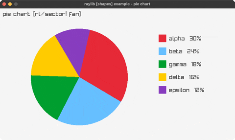

# pie-chart

labelled pie slices via rl/sector!

Category: shapes

Ported from raylib's `examples/shapes/shapes_pie_chart.c`.



## Run it

```sh
cd pie-chart && bb run   # from this demo (or jolt run, jolt -M:run)
bb pie-chart             # from the repo root (or jolt -M:pie-chart)
```

## About

raylib [shapes] example - pie chart. Fixed category data drawn as filled slices
via rl/sector! (an rlgl triangle fan), with a legend column. The whole chart
rotates slowly. Port of shapes_pie_chart.
