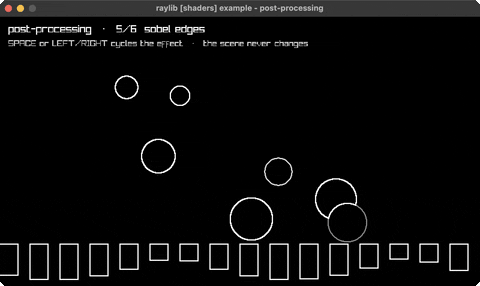

# postprocessing

post-process shaders cycled over a scene

Category: shaders



## Run it

```sh
cd postprocessing && bb run   # from this demo (or jolt run, jolt -M:run)
bb postprocessing             # from the repo root (or jolt -M:postprocessing)
```

## About

raylib [shaders] example - post-processing (`jolt -M:postprocessing`).

The two-pass shape every post-process effect has: draw the scene into an
off-screen framebuffer, then draw that framebuffer's texture back to the
window with a fragment shader in the way. The scene itself knows nothing about
the effect, which is the whole point - the same pass drives all six here.

SPACE (or LEFT/RIGHT) cycles the effect. Six of them, each one uniform or two:
none, grayscale, posterize, pixelate, sobel edges, and a chromatic-aberration
split.

The shader runs on the FBO's texture, so it samples with fragTexCoord rather
than gl_FragCoord and the resolution arrives as a uniform - that keeps the
kernel effects (pixelate, sobel) independent of the window size.

Framebuffer textures are bottom-up in GL's convention, so the FBO is drawn
back with :v0 1.0 :v1 0.0.
