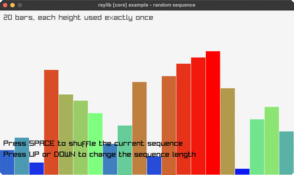

<!-- Generated by `bb resync` from raylib-jlt. Edits here are overwritten. -->
# random-sequence

bars in a shuffled order, each height used once

Category: core



## Run it

```sh
cd random-sequence && bb run   # from this demo (or jolt run, jolt -M:run)
bb random-sequence             # from the repo root (or jolt -M:random-sequence)
```

## About

raylib [core] example - random sequence (`jolt -M:random-sequence`).

Port of raylib's examples/core/core_random_sequence.c. A row of coloured bars
whose heights are a shuffled sequence. SPACE reshuffles, UP and DOWN change how
many bars there are.

The example is about LoadRandomSequence, which hands back each value in a range
exactly once in random order. That is a different thing from GetRandomValue,
which is bound here and which samples with replacement: calling it n times gives
duplicates and gaps, so the bars would not be a permutation and reshuffling
would change the set rather than just the order. Clojure's shuffle is the same
guarantee, so this uses it and leaves get-random-value to the examples that
genuinely want independent draws.

Reshuffling only reorders. Watch a colour move rather than change: the bars
keep their heights and hues across a SPACE, which is the property the example
is demonstrating.
