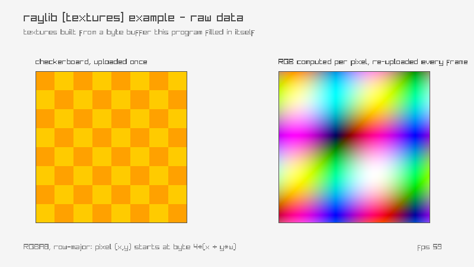

<!-- Generated by `bb resync` from raylib-jlt. Edits here are overwritten. -->
# raw-data

textures built from a hand-filled byte buffer

Category: textures



## Run it

```sh
cd raw-data && bb run   # from this demo (or jolt run, jolt -M:run)
bb raw-data             # from the repo root (or jolt -M:raw-data)
```

## About

raylib [textures] example - raw data (`jolt -M:raw-data`).

Port of raylib's examples/textures/textures_raw_data.c. The C does two
things: it loads fudesumi.raw, a headerless dump of RGBA bytes, and it
MemAllocs a Color array, fills it with a checkerboard by hand and hands
that to LoadTextureFromImage. Only the second half survives here, because
no files ship in this suite, but the second half was always the
interesting one. Both are the same idea anyway: a texture is a flat block
of bytes, and nothing says those bytes have to come from a decoder.

Both panels go up through rl/texture-from-fn, which allocates a w*h*4
staging buffer, walks it writing one packed RGBA8 word per pixel, and
frees it once rlLoadTexture has copied it to the GPU. Left is upstream's
checkerboard. Right computes all four channels separately from x and y, so
the colour at a pixel is arithmetic and nothing else, and it is re-uploaded
every frame with rl/update-texture-from-fn! to make that visible.

Layout is row-major with four bytes to a pixel, so pixel (x,y) begins at
byte 4*(x + y*w). Get that stride wrong and you get a diagonal smear, which
is the classic tell.
