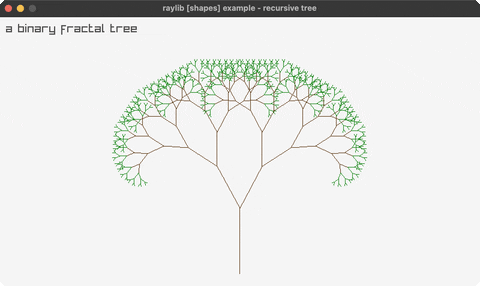

<!-- Generated by `bb resync` from raylib-jlt. Edits here are overwritten. -->
# recursive-tree

a binary fractal tree

Category: shapes



## Run it

```sh
cd recursive-tree && jolt -M:run   # from this demo
jolt -M:recursive-tree             # from the repo root
```

## About

raylib [shapes] example - recursive tree (`joltc -M:recursive-tree`).

A binary fractal tree drawn with lines: each branch spawns two shorter branches
at ±angle until a depth limit, brown trunk fading to green tips. Pure trig over
draw-line.
