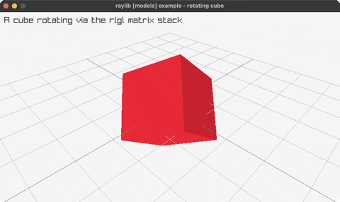

# rotating-cube

a single cube spinning via the rlgl matrix stack

Category: 3d



## Run it

```sh
cd rotating-cube && bb run   # from this demo (or jolt run, jolt -M:run)
bb rotating-cube             # from the repo root (or jolt -M:rotating-cube)
```

## About

raylib [models] example - a single cube rotating in place via the rlgl matrix
stack. Fixed 3D camera; the cube spins on X and Y with a frame-driven angle.
See docs/guide/rlgl-immediate-mode.md.
