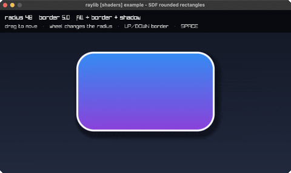

<!-- Generated by `bb resync` from raylib-jlt. Edits here are overwritten. -->
# rounded-rect-shader

SDF rounded rects: fill, border, shadow

Category: shaders



## Run it

```sh
cd rounded-rect-shader && bb run   # from this demo (or jolt run, jolt -M:run)
bb rounded-rect-shader             # from the repo root (or jolt -M:rounded-rect-shader)
```

## About

raylib [shaders] example - SDF rounded rectangles (`jolt -M:rounded-rect-shader`).

Fill, border and drop shadow from one signed distance function, evaluated per
pixel. The distance to a rounded rectangle is a two-line closed form, and every
visual feature falls out of thresholding it: inside is fill, a band either side
of zero is the border, and the same distance blurred and offset is the shadow.

That is the point of the technique. A rounded rectangle built from geometry
needs corner tessellation, and its border and shadow need separate passes and
separate meshes; here changing the radius is changing one number, and antialias
is free because the distance is continuous rather than sampled.

Compare `rounded-rectangle` elsewhere in this suite, which builds the same shape
out of rl/sector! corners and rectangles - the honest way to do it without a
shader, and visibly more code for a harder-edged result.

Drag to move the card, wheel changes the corner radius, UP/DOWN the border
width, SPACE cycles what is drawn: everything, then the raw distance field.
