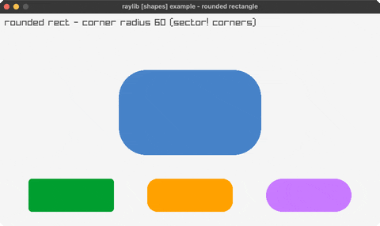

<!-- Generated by `bb resync` from raylib-jlt. Edits here are overwritten. -->
# rounded-rectangle

rounded rects via sector! corners

Category: shapes

Ported from raylib's `examples/shapes/shapes_rounded_rectangle_drawing.c`.



## Run it

```sh
cd rounded-rectangle && bb run   # from this demo (or jolt run, jolt -M:run)
bb rounded-rectangle             # from the repo root (or jolt -M:rounded-rectangle)
```

## About

raylib [shapes] example - rounded rectangle. A rect with quarter-circle corners,
built from a cross of rects + four sector! corner disks. That hand-rolling dates from
when raylib's DrawRectangleRounded was genuinely out of reach: it takes a Rectangle by
value and jolt could not pass one. jolt 0.7.23 changed that, and rl/rect-rounded! now
binds the real call (see net.b12n.raylib-jlt.outlines-thickness). This example is left
on the hand-rolled path deliberately, the way the rest of the suite's rlgl stand-ins
are, rather than migrated in passing. The corner radius animates 0 -> max. Port of
shapes_rounded_rectangle_drawing.
