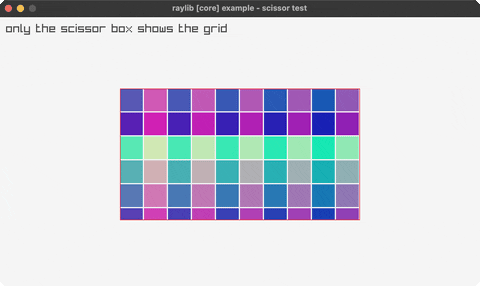

<!-- Generated by `bb resync` from raylib-jlt. Edits here are overwritten. -->
# scissor-test

a scissor rectangle clips a grid

Category: core



## Run it

```sh
cd scissor-test && jolt -M:run   # from this demo
jolt -M:scissor-test             # from the repo root
```

## About

raylib [core] example - scissor test (`joltc -M:scissor-test`).

A colorful grid is drawn across the whole window, but a scissor rectangle clips
drawing so only the part inside the box is visible. Uses the scalar
BeginScissorMode / EndScissorMode.
