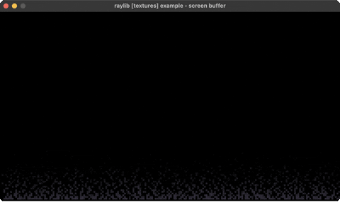

<!-- Generated by `bb resync` from raylib-jlt. Edits here are overwritten. -->
# screen-buffer

the classic DOS fire effect

Category: textures



## Run it

```sh
cd screen-buffer && bb run   # from this demo (or jolt run, jolt -M:run)
bb screen-buffer             # from the repo root (or jolt -M:screen-buffer)
```

## About

raylib [textures] example - screen buffer.

The classic DOS fire effect as a software screen buffer: a low-res
palette-indexed grid is simulated every frame (embers grow at the
bottom row, rise with random drift and decay) and blitted through a
256-color flame palette into a texture drawn scaled up.

No new FFI: the ember grid is a plain Clojure vector rather than a
native buffer (doom.clj's own zbuffer takes the same approach), and
the blit reuses rl/update-texture-from-fn! exactly as every other
procedural-texture example does. Runs the simulation at 200x112
rather than the C's 400x225: a persistent-vector rewrite of ~11000
live cells a frame is about the budget that keeps this near 60fps in
jolt, and the DOS original was chunky-pixel by nature anyway.
Ported from raylib's examples/textures/textures_screen_buffer.c.
