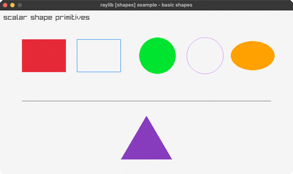

# shapes

shape primitives + an rlgl triangle

Category: shapes

Ported from raylib's `examples/shapes/shapes_basic_shapes.c`.



## Run it

```sh
cd shapes && bb run   # from this demo (or jolt run, jolt -M:run)
bb shapes             # from the repo root (or jolt -M:shapes)
```

## About

raylib [shapes] example - basic shapes (`joltc -M:shapes`).

A tour of the scalar shape primitives: filled and outlined rectangles and
circles, an ellipse, a line, and a triangle drawn via rlgl immediate mode.
raylib's DrawTriangle takes Vector2 args by value; rlBegin / rlVertex2f is the
scalar path (see net.b12n.raylib.rlgl's rl-* bindings).

## Background in the raylib-jlt guide

- [rlgl immediate mode: for the by-value float structs the pointer trick can't fake](https://github.com/jlt-commons/raylib-jlt/blob/main/docs/guide/rlgl-immediate-mode.md)
