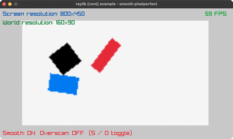

<!-- Generated by `bb resync` from raylib-jlt. Edits here are overwritten. -->
# smooth-pixelperfect

sub-pixel camera smoothing at 5x upscale

Category: core



## Run it

```sh
cd smooth-pixelperfect && bb run   # from this demo (or jolt run, jolt -M:run)
bb smooth-pixelperfect             # from the repo root (or jolt -M:smooth-pixelperfect)
```

## About

raylib [core] example - smooth pixelperfect.

Three rectangles spin inside a tiny 160x90 pixel-art world rendered to a
render texture and upscaled 5x to the window. The camera sways on a
sine/cosine path; the world camera gets the integer part of its position
and the screen camera gets the sub-pixel remainder, which smooths the
upscaled motion. S toggles the smoothing, O toggles overscan. No new
bindings: rl/rect-pro! already draws a rotated rectangle by origin, the
same DrawRectanglePro stand-in easings-rectangles.clj already uses.
Ported from raylib's examples/core/core_smooth_pixelperfect.c.
