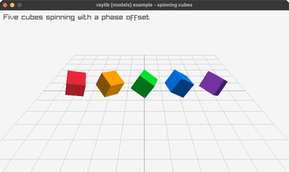

<!-- Generated by `bb resync` from raylib-jlt. Edits here are overwritten. -->
# spinning-cubes

a row of cubes each spinning with a phase offset

Category: 3d



## Run it

```sh
cd spinning-cubes && jolt -M:run   # from this demo
jolt -M:spinning-cubes             # from the repo root
```

## About

raylib [models] example - a row of cubes each spinning in place with a
per-index phase offset (distinct from waving-cubes, which translates a grid).
See docs/guide/rlgl-immediate-mode.md.
