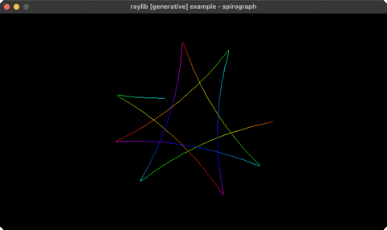

# spirograph

animated hypotrochoid roulette curves

Category: generative



## Run it

```sh
cd spirograph && bb run   # from this demo (or jolt run, jolt -M:run)
bb spirograph             # from the repo root (or jolt -M:spirograph)
```

## About

raylib [generative] example - an animated hypotrochoid (spirograph). A pen offset d
on a wheel of radius r rolling inside a ring of radius R traces roulette curves;
resets with new random r/d after a fixed number of points.
