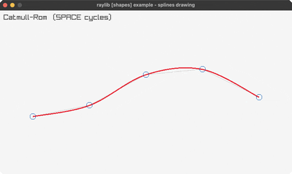

<!-- Generated by `bb resync` from raylib-jlt. Edits here are overwritten. -->
# splines

Catmull-Rom / Bezier / B-spline (SPACE cycles)

Category: shapes

Ported from raylib's `examples/shapes/shapes_splines_drawing.c`.



## Run it

```sh
cd splines && bb run   # from this demo (or jolt run, jolt -M:run)
bb splines             # from the repo root (or jolt -M:splines)
```

## About

raylib [shapes] example - spline drawing. Five control points bob
vertically; each spline is drawn as a chain of real DrawSplineSegment*
calls, one Vector2-by-value argument per point, rather than a from-scratch
math reimplementation. SPACE cycles Catmull-Rom / cubic Bezier / uniform
B-spline. Port of shapes_splines_drawing (minus raygui).

raylib's DrawSpline* take a Vector2 array by value, which jolt could not
bind before 0.7.23. The per-point DrawSplineSegment* calls used here are
the same decomposition raylib's own C example shows commented out: one
Vector2 per point, staged via rl/spline-segment-catmull-rom!/-basis!/
-bezier-cubic! (new FFI, shared with this session's splines-drawing work).
This replaces an earlier scalar-math version that predated by-value struct
support and, correctly at the time, called DrawSpline* unbindable.
