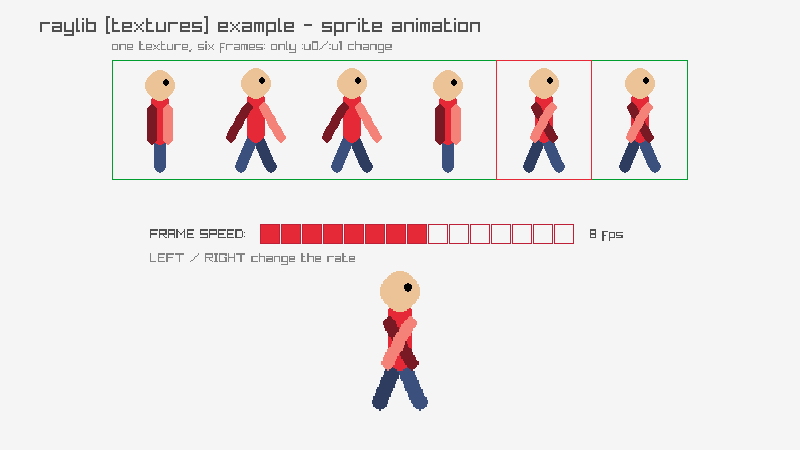

<!-- Generated by `bb resync` from raylib-jlt. Edits here are overwritten. -->
# sprite-animation

six generated poses, one source rectangle

Category: textures



## Run it

```sh
cd sprite-animation && bb run   # from this demo (or jolt run, jolt -M:run)
bb sprite-animation             # from the repo root (or jolt -M:sprite-animation)
```

## About

raylib [textures] example - sprite animation (`jolt -M:sprite-animation`).

Port of raylib's examples/textures/textures_sprite_animation.c. The C loads
scarfy.png, a strip of six frames, and walks a source rectangle along it.
No image files ship here, so the strip is generated at startup: six poses of
a stick walker, drawn with the ImageDraw* family into one wide image.

The animation itself is the part worth understanding, and it is entirely
about the source rectangle. One texture goes to the GPU once and never
changes. What changes is which sixth of it the quad samples, which
rl/texture! expresses as :u0 and :u1. Nothing is uploaded per frame and
nothing is redrawn into the image.

The strip is shown at the top with the current frame boxed, so the
relationship between the sheet and the figure below it stays visible.
LEFT and RIGHT change the playback rate, which is counted in whole frames
at 60 fps, so the speeds it steps through are coarse on purpose.
