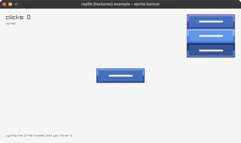

<!-- Generated by `bb resync` from raylib-jlt. Edits here are overwritten. -->
# sprite-button

one sheet, three states, sliced by v

Category: textures



## Run it

```sh
cd sprite-button && bb run   # from this demo (or jolt run, jolt -M:run)
bb sprite-button             # from the repo root (or jolt -M:sprite-button)
```

## About

raylib [textures] example - sprite button (`jolt -M:sprite-button`).

Port of raylib's examples/textures/textures_sprite_button.c. One texture
holding three stacked frames, normal, hover and pressed, and the button picks
its frame by moving a window down the sheet rather than by swapping textures.
Click it and the counter goes up.

Zero new FFI. A sprite sheet is a source rectangle and nothing more, so the
whole mechanism is `texture!` with `:v0` and `:v1` set to the third of the
image the current state lives in, which is the same UV slicing `textured-cube`
and `directional-billboard` use for their atlases. Dividing one texture rather
than binding three is the point: the GPU keeps one upload and the batch never
breaks to change texture between frames.

Two deviations. The C loads `resources/button.png`, and this suite ships no
image files, so the sheet is drawn with `texture-from-fn`, all three frames in
one pass, with the lit edge moving and the label shifting down a pixel when
pressed. And the C plays `buttonfx.wav` on release through `LoadSound`, which
needs raylib's `Sound` bindings this suite does not have yet: the audio here
is `audio-raw-stream` and `audio-stream-callback`, both of which generate their
samples rather than loading them. The click is silent and counted instead.
