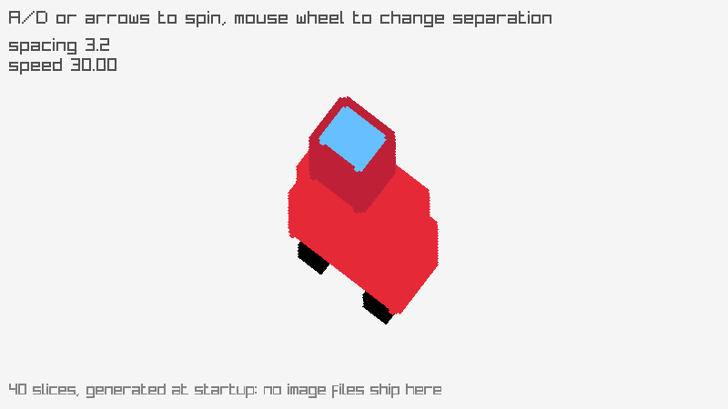

<!-- Generated by `bb resync` from raylib-jlt. Edits here are overwritten. -->
# sprite-stacking

40 generated slices faking a 3D car

Category: textures



## Run it

```sh
cd sprite-stacking && jolt -M:run   # from this demo
jolt -M:sprite-stacking             # from the repo root
```

## About

raylib [textures] example - sprite stacking (`jolt -M:sprite-stacking`).

Port of raylib's examples/textures/textures_sprite_stacking.c. The C loads
booth.png, a fairground booth sliced into 122 horizontal layers, and this
suite ships no image files, so the sheet here is generated at startup: 40
top-down slices of a small car, painted into one tall image with the
ImageDraw* family and uploaded once.

Sprite stacking fakes a 3D object out of 2D art. Each slice is drawn at the
same rotation, offset a little further up the screen than the one below it,
and the eye reads the pile as a solid body turning in place. Row 0 of the
sheet is the roof and row 39 is the wheels, so the loop walks from the last
row to the first and the roof lands on top.

This is the example that needed rl/texture! to learn about rotation. Until
now it only emitted axis-aligned quads, which is all DrawTexturePro's
by-value Rectangle/Vector2 arguments let the rlgl stand-in do. It now takes
:rotation with :origin-x/:origin-y, rotates the four corners about that
pivot before emitting them, and leaves the default-origin unrotated case
producing byte-identical frames.

A and D, or the arrow keys, change the spin speed. The mouse wheel changes
the spacing between layers, which is what sells the illusion or breaks it.
