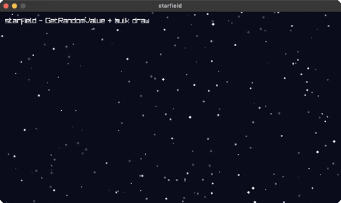

<!-- Generated by `bb resync` from raylib-jlt. Edits here are overwritten. -->
# stars

a twinkling starfield

Category: shapes



## Run it

```sh
cd stars && bb run   # from this demo (or jolt run, jolt -M:run)
bb stars             # from the repo root (or jolt -M:stars)
```

## About

A twinkling starfield (`joltc -M:stars`).

Not a raylib example port, a small demo that scatters stars with GetRandomValue
(once, at startup) and redraws them each frame with a per-star twinkle. Shows
bulk scalar drawing and a computed (non-palette) Color per star.
