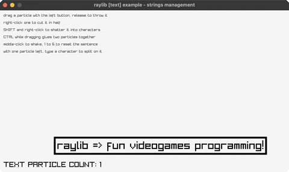

<!-- Generated by `bb resync` from raylib-jlt. Edits here are overwritten. -->
# strings-management

bouncing text you slice, shatter and glue

Category: text



## Run it

```sh
cd strings-management && bb run   # from this demo (or jolt run, jolt -M:run)
bb strings-management             # from the repo root (or jolt -M:strings-management)
```

## About

raylib [text] example - strings management (`jolt -M:strings-management`).

Port of raylib's examples/text/text_strings_management.c. A sentence is one
bouncing text particle. Drag it with the left button and let go to throw it,
right-click to cut it in half, hold SHIFT and right-click to shatter it into
single characters, middle-click to shake everything, and hold CTRL while
dragging one particle over another to glue the two into a longer one. With
exactly one particle left, typing a character splits the sentence on it. 1 to
6 reset the sentence through a different case transform each.

Zero new FFI, and only rl/MOUSE-MIDDLE is new as a constant. That is the
point of this one: the C is a tour of raylib's own string helpers, TextCopy,
TextSubtext, TextSplit, TextLength, TextFormat and the six TextTo* case
conversions, which exist because C has no string library. Clojure does, so
every one of them is subs, count, str and clojure.string here, and the only
raylib call left in the text path is MeasureText, which has to be raylib's
because only raylib knows how wide its font draws.

One deviation. The C tracks the grabbed particle by pointer, so a slice can
leave that pointer dangling into a shifted array. Particles here are a vector
and the grab is an index into it, so anything that rebuilds the vector drops
the grab rather than carrying a stale index forward.
