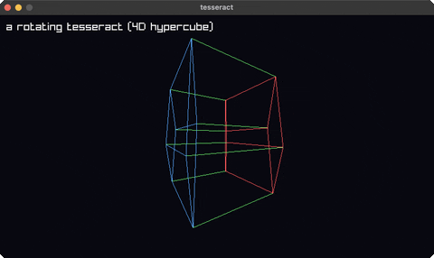

# tesseract-view

a rotating 4D hypercube projected to 2D

Category: 3d



## Run it

```sh
cd tesseract-view && bb run   # from this demo (or jolt run, jolt -M:run)
bb tesseract-view             # from the repo root (or jolt -M:tesseract-view)
```

## About

Tesseract (`joltc -M:tesseract-view`).

A rotating 4D hypercube: 16 vertices (every coordinate ±1) and 32 edges (a pair
is joined when it differs in exactly one coordinate). It spins in two 4D planes,
then projects 4D→3D→2D by perspective, so the inner cube appears to turn
inside-out through the outer one. Pure math + 2D lines, no camera. Inner cube is
red, outer cube blue, the connecting edges green.
