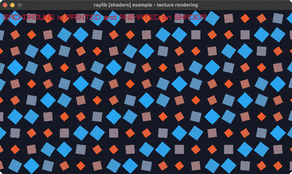

<!-- Generated by `bb resync` from raylib-jlt. Edits here are overwritten. -->
# texture-rendering

a grid of squares painted entirely by a shader

Category: shaders



## Run it

```sh
cd texture-rendering && bb run   # from this demo (or jolt run, jolt -M:run)
bb texture-rendering             # from the repo root (or jolt -M:texture-rendering)
```

## About

raylib [shaders] example - texture rendering.

A grid of squares panned, rotated and recolored entirely by a fragment
shader: nothing is drawn on the Clojure side except one full-window
rect, the same rl/rect! + rl/with-shader pattern eratosthenes-sieve.clj
uses. raylib's own C example draws over a 1024x1024 BLANK texture to
give the shader something to paint into GPU memory; here the full-quad
rect stands in for that blank texture, so there's no texture at all.

The shader itself is an original grid-of-squares animation (panning,
per-cell rotation, size and color driven by a phase offset unique to
each cell), not a port of raylib's own cubes_panning.fs.
Loosely based on raylib's examples/shaders/shaders_texture_rendering.c.
