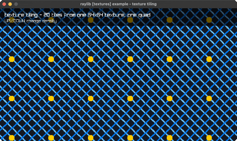

# texture-tiling

one tile repeated across the window

Category: textures



## Run it

```sh
cd texture-tiling && bb run   # from this demo (or jolt run, jolt -M:run)
bb texture-tiling             # from the repo root (or jolt -M:texture-tiling)
```

## About

raylib [textures] example - texture tiling (`jolt -M:texture-tiling`).

One small procedural tile covers the whole window by asking for texture
coordinates well past 1.0 and letting the GPU's REPEAT wrap mode do the
repeating, so the number of tiles on screen costs nothing extra to draw. UP/DOWN
change the tile density and the whole field scrolls diagonally.

Scrolling is just an offset added to both texcoords, which is why the seam never
shows: a REPEAT sampler treats 4.25 and 0.25 identically.
