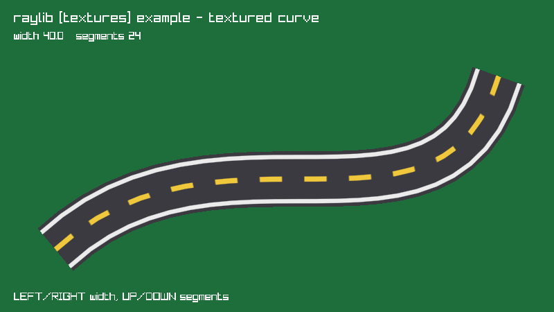

<!-- Generated by `bb resync` from raylib-jlt. Edits here are overwritten. -->
# textured-curve

a texture laid along a cubic Bezier

Category: textures



## Run it

```sh
cd textured-curve && jolt -M:run   # from this demo
jolt -M:textured-curve             # from the repo root
```

## About

raylib [textures] example - textured curve (`jolt -M:textured-curve`).

Port of raylib's examples/textures/textures_textured_curve.c. A texture is
laid along a cubic Bezier by walking the curve in segments and emitting one
quad per segment, each rotated to sit square across the curve at that point.

The two ideas worth taking away are both in draw-curve!. The quad's corners
come from the normal of the segment's direction, which is the direction
vector with its components swapped and one negated, so the ribbon stays the
same width through a bend instead of pinching. And the v texture coordinate
accumulates by arc length rather than by segment index, so the road markings
keep an even spacing whether a segment is long or short. Dividing by index
would bunch them up wherever the curve turns tightly.

Because v runs well past 1.0 the texture wrap has to be REPEAT, which is the
one setting that turns this from a stretched smear into a repeating road.

rl/texture! is no use here: it emits one axis-aligned quad, and this needs a
strip of many, each at its own angle. The rlgl immediate-mode calls are
public for exactly this, the same way net.b12n.raylib-jlt.magnifying-glass
builds its lens out of a triangle fan.

No image files ship here, so the road is generated: asphalt, solid edge
lines and a dashed centre line, painted with the ImageDraw* family.

The curve flexes on its own. LEFT and RIGHT change the ribbon width, UP and
DOWN change the segment count, and dropping the count low enough makes the
faceting obvious, which is the honest way to see what the strip is made of.
