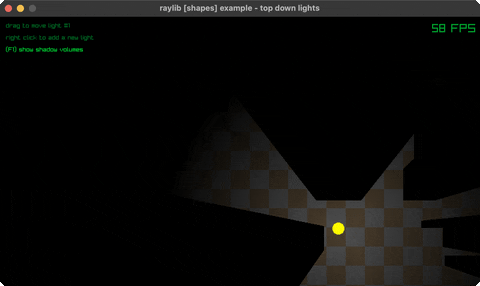

<!-- Generated by `bb resync` from raylib-jlt. Edits here are overwritten. -->
# top-down-lights

lights and shadow volumes in an alpha mask

Category: shapes



## Run it

```sh
cd top-down-lights && jolt -M:run   # from this demo
jolt -M:top-down-lights             # from the repo root
```

## About

raylib [shapes] example - top down lights (`jolt -M:top-down-lights`).

Port of raylib's examples/shapes/shapes_top_down_lights.c, contributed there by
Jeffery Myers. Drag light #1 with the left mouse button, right-click to drop
another one (16 in total), F1 shows the shadow volumes light #1 is casting.

The trick is that nothing here draws light. Every light renders a full-screen
mask whose ALPHA channel is the only part that matters, all the masks are
merged into one, and that one is drawn over the scene as black. Alpha 0 reads
as lit because the black is fully transparent there; alpha 1 reads as dark.

Two custom blend equations do the merging, and they are why this example needs
`rl/set-blend-factors`. GL_MIN keeps the smaller of source and destination, so
a light's gradient punches its transparent centre into a mask cleared to opaque
white, and the master mask ends up with the brightest of the lights that reach
each pixel. GL_MAX keeps the larger, so a shadow quad drawn at alpha 1 cuts
itself straight back out of the disc. Note GL_MIN and GL_MAX ignore the
src/dst factors entirely, which is why the same SRC_ALPHA pair is passed to
both: only the equation is doing work.

Three deviations from the C. The shadow quads are two rlgl triangles wound
front-facing rather than a DrawTriangleFan, whose Vector2 array is by value.
A light standing inside a box still redraws its mask, so it goes properly
dark; the C returns early there and leaves the previous frame's mask up. And
light #1 walks a slow figure-eight until the first drag, because no synthetic
input actuates a raylib window (see the note in scripts/demo_manifest.edn), so
an example with no motion of its own records as a single frame. Touch the
light once and it stays wherever you leave it.
