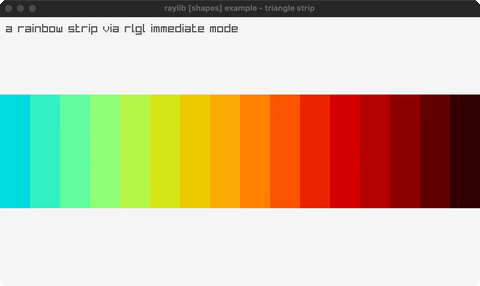

<!-- Generated by `bb resync` from raylib-jlt. Edits here are overwritten. -->
# triangle-strip

a rainbow strip via rlgl immediate mode

Category: shapes



## Run it

```sh
cd triangle-strip && jolt -M:run   # from this demo
jolt -M:triangle-strip             # from the repo root
```

## About

raylib [shapes] example - triangle strip (`joltc -M:triangle-strip`).

A rainbow band across the window built vertex by vertex via rlgl immediate mode
(rlBegin RL_TRIANGLES + rlColor4ub + rlVertex2f), the scalar path around
raylib's by-value Vector2 shape APIs.
