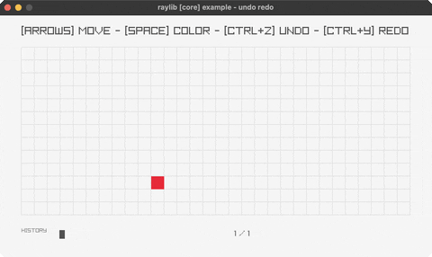

# undo-redo

move a square, then step back through the history

Category: core



## Run it

```sh
cd undo-redo && bb run   # from this demo (or jolt run, jolt -M:run)
bb undo-redo             # from the repo root (or jolt -M:undo-redo)
```

## About

raylib [core] example - undo redo (`jolt -M:undo-redo`).

Port of raylib's examples/core/core_undo_redo.c. Drive a square around a grid
with the arrows, recolour it with SPACE, and step through the history with
CTRL-Z and CTRL-Y. Visited cells stay on screen as a trail, and the strip along
the bottom shows the history itself: how many states are held, and where the
cursor sits inside them.

The C keeps a 26-slot ring buffer of PlayerState and moves three indices around
it. That does not port straight across, because the interesting part is the
bounded history rather than the pointer arithmetic, and Clojure already has a
better shape for it: a vector of states plus a cursor. Recording past the cap
drops the oldest entry, which is what the ring achieves by overwriting.

The one behaviour worth preserving exactly is that a new move after an undo
discards whatever was ahead. The C gets that by assigning lastUndoIndex after
it writes, so the redo tail becomes unreachable; here the tail is dropped
outright.
