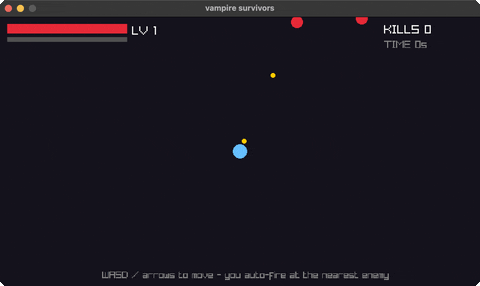

<!-- Generated by `bb resync` from raylib-jlt. Edits here are overwritten. -->
# vampire-survivors

auto-fire survival: move, waves chase you

Category: games



## Run it

```sh
cd vampire-survivors && jolt -M:run   # from this demo
jolt -M:vampire-survivors             # from the repo root
```

## About

Vampire Survivors (`joltc -M:vampire-survivors`).

A tiny survivors-like: move with WASD / arrows, and your hero auto-fires at the
nearest enemy. Enemies stream in from the edges and chase you; shooting one drops
an XP gem, and collecting gems levels you up (which speeds up your fire rate).
Touching an enemy costs HP; survive as long as you can. ENTER restarts.

One immutable state map threaded through the loop; `step` reads input and returns
the next state.
