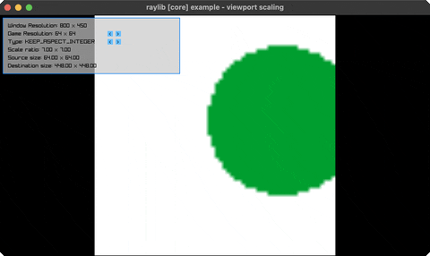

<!-- Generated by `bb resync` from raylib-jlt. Edits here are overwritten. -->
# viewport-scaling

6 viewport-scaling policies, resize live

Category: core



## Run it

```sh
cd viewport-scaling && jolt -M:run   # from this demo
jolt -M:viewport-scaling             # from the repo root
```

## About

raylib [core] example - viewport scaling.

A game scene rendered at a fixed 'game resolution' into a render texture,
scaled into a resizable window under six viewport policies (keep aspect /
height / width, each with an integer pixel-snap variant). Two < > button
pairs cycle the game resolution (64x64 / 256x240 / 320x180 / 4K) and the
policy; a LIME circle tracks the mouse mapped into game space. Resize the
window to see each policy react. No new bindings, and no atom-boxing
workaround either: unlike the jank port, a Clojure loop/recur can carry
the render-texture map directly as accumulator state, recreated (unload +
render-texture) whenever the window or the chosen mode changes.
Ported from raylib's examples/core/core_viewport_scaling.c.
