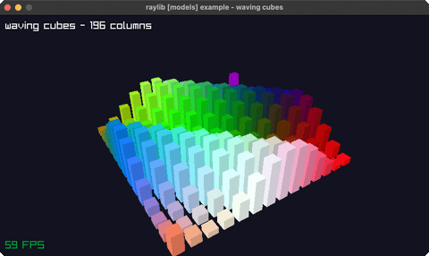

# waving-cubes

an NxN grid of cubes rippling in 3D

Category: 3d

Ported from raylib's `examples/models/models_waving_cubes.c`.



## Run it

```sh
cd waving-cubes && bb run   # from this demo (or jolt run, jolt -M:run)
bb waving-cubes             # from the repo root (or jolt -M:waving-cubes)
```

## About

raylib [models] example - waving cubes (`joltc -M:waving-cubes`).

An N×N grid of cubes whose heights ripple like water via a sine wave of position
+ time, coloured by position, under a slowly orbiting 3D camera. Same 3D path as
camera-3d: Camera3D by value (pointer) + rlgl immediate-mode geometry
(net.b12n.raylib.models/cube!), since raylib's DrawCube takes a by-value Vector3.

Each cube is 36 rlVertex3f FFI calls, so the grid is kept modest (N=14 → 196
columns) to stay smooth; DrawFPS shows the real rate.
