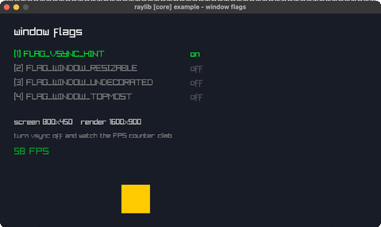

<!-- Generated by `bb resync` from raylib-jlt. Edits here are overwritten. -->
# window-flags

toggle vsync/resizable/topmost live

Category: core



## Run it

```sh
cd window-flags && jolt -M:run   # from this demo
jolt -M:window-flags             # from the repo root
```

## About

raylib [core] example - window flags (`jolt -M:window-flags`).

The window's configuration bits, toggled live. Number keys 1-4 flip vsync,
resizable, undecorated and always-on-top; the list shows which are on, read back
from raylib with IsWindowState rather than from a local copy, so it stays honest
if the window manager refuses one.

A bouncing box gives the frame rate something to say: with vsync off the FPS
counter climbs to whatever the machine can manage, and the box moves by delta
time so its speed does not change with it.
