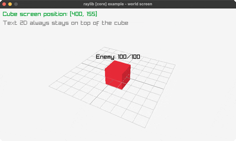

# world-screen

a 2D label tracks a cube via GetWorldToScreen

Category: 3d



## Run it

```sh
cd world-screen && bb run   # from this demo (or jolt run, jolt -M:run)
bb world-screen             # from the repo root (or jolt -M:world-screen)
```

## About

raylib [core] example - world screen.

A floating 2D label pinned above a 3D cube: each frame the cube's world
position projects to screen space via GetWorldToScreen, so the label tracks
it as the camera orbits. First use of a genuine by-value Camera3D (see
rl/world-to-screen); the SAME camera opts map drives both with-camera-3d and
rl/world-to-screen, so the label always matches what actually got drawn.
Ported from raylib's examples/core/core_world_screen.c.
